# Healthcare Care Coordinator — Agentic AI Demo

A **multi-agent LangGraph application** demonstrating policy-aware care coordination for healthcare scheduling. This demo showcases supervisor-based agent orchestration, tool calling, and conditional routing patterns.

> [!IMPORTANT]
> This is a **demonstration** for educational purposes only. It is **NOT** medical advice and should not be used for real healthcare decisions.

---

## Overview

The Healthcare Care Coordinator simulates a patient intake workflow where:
1. A **Supervisor** routes requests between specialized agents
2. A **Triage Nurse** gathers patient information and checks policies
3. A **Care Coordinator** synthesizes findings into a patient-friendly plan

The system demonstrates how to build compliant, policy-aware agentic workflows using LangGraph.

---

## Architecture

### High-Level Component Diagram

```mermaid
graph TB
    subgraph "LangGraph Application"
        SUP["🎯 Supervisor<br/>(Router)"]
        TN["🩺 Triage Nurse<br/>(Information Gatherer)"]
        CC["📝 Care Coordinator<br/>(Plan Synthesizer)"]
        TOOLS["🔧 Tool Node<br/>(LangGraph ToolNode)"]
    end
    
    subgraph "Mock Healthcare Tools"
        T1["patient_record"]
        T2["appointment_slots"]
        T3["medication_info"]
        T4["coverage_check"]
        T5["policy_check"]
    end
    
    subgraph "Infrastructure"
        LLM["LLM Backend<br/>(OpenAI-compatible)"]
        LOG["Logging System<br/>(HTTP + LLM)"]
    end
    
    SUP --> TN
    SUP --> CC
    TN <--> TOOLS
    TOOLS --> T1 & T2 & T3 & T4 & T5
    TN --> LLM
    CC --> LLM
    SUP --> LLM
    LLM --> LOG
```



### Agent Workflow (State Machine)


---

## Agentic Flow

### Detailed Sequence Diagram


---

## Component Details

### 1. Supervisor Node

The supervisor is the **orchestrator** that decides which agent should handle the request next.

| Decision | Trigger Condition |
|----------|-------------------|
| `triage_nurse` | Patient info, coverage, or policy checks needed |
| `care_coordinator` | Triage notes present, ready for synthesis |
| `end` | Final plan already exists |

**Failsafe**: Maximum 12 supervisor calls to prevent infinite loops.

---

### 2. Triage Nurse Node

The triage nurse **gathers information** using available tools and produces structured `[TRIAGE NOTES]`.

**Responsibilities:**
- Fetch patient demographics, allergies, conditions
- Check appointment availability
- Verify insurance coverage
- Validate against policy constraints
- Propose compliant alternatives when requests are blocked

---

### 3. Care Coordinator Node

The care coordinator **synthesizes** all gathered information into a patient-friendly plan.

**Output Sections:**
1. **Summary** — Brief overview
2. **Appointment Recommendation** — Visit type + specialty
3. **Available Slots** — Top scheduling options
4. **Coverage & Pre-Auth Notes** — Insurance details
5. **Policy Check Results** — PASS/REQUIRES_REVIEW/BLOCKED
6. **Next Steps** — Patient action items
7. **Safety Note** — When to seek urgent care

---

### 4. Tool Node

Built using LangGraph's `ToolNode`, this node executes tool calls from the triage nurse.

| Tool | Purpose |
|------|---------|
| `patient_record` | Demographics, conditions, allergies, meds, insurance |
| `appointment_slots` | Available slots by clinic, specialty, date range |
| `medication_info` | High-level drug/service information |
| `coverage_check` | Copay and pre-auth requirements |
| `policy_check` | Compliance validation (BLOCKED/REQUIRES_REVIEW/PASS) |

---

## Policy Engine

The `policy_check` tool enforces healthcare compliance rules:

```mermaid
flowchart LR
    subgraph "Policy Rules"
        R1["🚫 Controlled Substances<br/>No telehealth initiation"]
        R2["⚠️ Antibiotics<br/>Require clinician assessment"]
        R3["📋 Imaging (MRI)<br/>Prior authorization required"]
        R4["👶 Minors<br/>Guardian consent required"]
    end
    
    R1 --> |BLOCKED| OUT
    R2 --> |REQUIRES_REVIEW| OUT
    R3 --> |REQUIRES_REVIEW| OUT
    R4 --> |REQUIRES_REVIEW| OUT
    
    OUT["Policy Decision"]
```



---

## State Management

The application uses LangGraph's `StateGraph` with the following state schema:

```python
class AgentState(TypedDict):
    messages: Annotated[list, add_messages]  # Conversation history
    next: str                                 # Routing decision
```

**Key Pattern**: Messages accumulate across the graph using `add_messages`, preserving full conversation context for each agent.

---

## Logging & Observability

### HTTP Layer Logging
- Captures raw HTTP requests/responses
- Useful for debugging OpenAI-compatible API integration

### LLM Layer Logging
- Logs serialized LangChain messages
- Tracks each agent's prompts and responses
- Output: `llm_log/run_<timestamp>/`

---

## Running the Demo

### Prerequisites

```bash
pip install langchain-openai langchain-core langgraph httpx python-dotenv
```

### Configuration

Set environment variables or create a `.env` file:

```bash
BASE_URL=http://localhost:8070/v1   # OpenAI-compatible endpoint
MODEL=Qwen3-1.7B                     # Model identifier
OPENAI_API_KEY=NONE                  # Required for OpenAI, use "NONE" for local
```

### Execute

```bash
cd session-02-workflow-graphs
python healthcare_care_coordinator.py
```

### Sample Output

The demo runs a sample scenario:
> Patient PT-1001 wants a refill and prefers telehealth. They mention 'oxycodone' for back pain and also ask about getting an MRI soon.

The system will:
1. Retrieve patient record
2. Check policy (oxycodone → BLOCKED for telehealth)
3. Check MRI coverage (prior auth required)
4. Propose compliant alternatives
5. Output a structured care coordination plan

---

## Policy Architecture (LLM-Driven)

The policy engine uses a **documentation-driven approach** where business rules are defined in markdown files instead of hardcoded logic.

### How It Works


1. **Policy documents** in `policies/` define rules in human-readable markdown
2. **At runtime**, the `policy_check` tool loads all policy files
3. **LLM interprets** the policies in context of the specific request
4. **Structured output** returns PASS/REQUIRES_REVIEW/BLOCKED with details

### Policy Files

| File | Description |
|------|-------------|
| `controlled_substances.md` | Opioids, Schedule II-V drug restrictions |
| `medication_prescribing.md` | Antibiotics, allergy conflict checks |
| `imaging_services.md` | MRI/CT prior authorization requirements |
| `patient_consent.md` | Minor consent, guardian requirements |
| `visit_type_restrictions.md` | Telehealth vs in-person rules |

### Benefits

- **No code changes** to update policies — just edit markdown
- **Audit trail** via Git history of policy changes
- **Business analyst friendly** — policies are human-readable
- **Contextual interpretation** — LLM understands nuance beyond keyword matching

---

## Key Concepts Demonstrated

| Concept | Implementation |
|---------|----------------|
| **Multi-agent orchestration** | Supervisor routes between specialized agents |
| **Tool calling** | Triage nurse invokes mock healthcare tools |
| **Conditional routing** | Graph edges based on state decisions |
| **Looping patterns** | Triage ↔ Tools loop until complete |
| **State accumulation** | Messages persist across graph traversal |
| **Policy enforcement** | Tool-based compliance checking |
| **Graceful degradation** | Failsafe limits prevent infinite loops |

---

## Extending the Demo

### Add New Tools
1. Define a new `@tool` decorated function
2. Add to the `tools` list
3. Update triage nurse's system prompt

### Modify Policy Rules
- Edit the `policy_check` function
- Add new violation/warning conditions

### Change Routing Logic
- Modify the `supervisor` node's decision logic
- Update `add_conditional_edges` if adding new agents

---

## License

This demo is part of the **Agentic AI with LangGraph Workshop Series**. See the root [LICENSE](../LICENSE) file.
