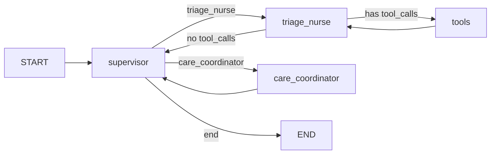

# Healthcare Care Coordinator Agent — Execution Walkthrough

This document provides a detailed trace of how the healthcare care coordinator agent processes a patient request. It explains the graph traversals, LLM calls, tool executions, and routing decisions.

## Overview

The agent uses a **LangGraph state machine** with four nodes:
- **`supervisor`** — Routes to the appropriate agent or ends the workflow
- **`triage_nurse`** — Gathers patient info, checks coverage/policy via tools
- **`tools`** — Executes tool calls (LangGraph's built-in ToolNode)
- **`care_coordinator`** — Synthesizes a patient-friendly care plan



---

## Sample Input

```
Patient PT-1001 wants a refill and prefers telehealth. They mention 'oxycodone' 
for back pain and also ask about getting an MRI soon. Please propose a compliant 
appointment plan and check coverage/policy constraints.
```

This is a complex request involving:
1. A controlled substance (oxycodone) refill
2. Diagnostic imaging (MRI)
3. Patient's telehealth preference
4. Policy and coverage validation

---

## Execution Trace

### Step 1: Supervisor Routes to Triage Nurse

| Field | Value |
|-------|-------|
| **LLM Call** | #1 |
| **Caller** | `supervisor` |
| **Timestamp** | 22:58:44 |

**System Prompt (excerpt):**
```
You are supervising a healthcare care-coordination workflow (NOT medical diagnosis).
Agents available:
- triage_nurse: gathers patient context, checks appointment availability, coverage, and policy constraints.
- care_coordinator: writes a clear patient-facing plan using triage notes + tool outputs.

Routing rules:
1) If patient info/appointments/coverage/policy checks are needed -> triage_nurse
2) If triage notes are present and sufficient to draft the plan -> care_coordinator
3) If a final plan already exists -> end

Return exactly ONE token: triage_nurse, care_coordinator, or end.
```

**LLM Response:**
```
<think>
Okay, let's tackle this. The patient, PT-1001, wants a refill and prefers telehealth. 
They mentioned oxycodone for back pain... Since the triage nurse hasn't confirmed 
coverage, we can't proceed without that. So the correct response is triage_nurse.
</think>

triage_nurse
```

**Routing Decision:** `supervisor` → `triage_nurse`

---

### Step 2: Triage Nurse Makes Initial Tool Calls

| Field | Value |
|-------|-------|
| **LLM Call** | #2 |
| **Caller** | `triage_nurse` |
| **Timestamp** | 22:58:48 |

**Triage Nurse's Reasoning:**
```
<think>
Okay, let's tackle this patient's request. First, I need to gather all the necessary 
information. The patient is PT-1001... I'll use policy_check to ensure the services 
are compliant. Finally, suggest appointment slots with telehealth and appropriate 
specialties.
</think>
```

**Tool Calls Generated (5 parallel calls):**

| Tool | Arguments | Purpose |
|------|-----------|---------|
| `patient_record` | `patient_id: "PT-1001"` | Get patient demographics, allergies, insurance |
| `medication_info` | `drug: "oxycodone"` | Check if it's a controlled substance |
| `coverage_check` | `insurance_plan: "unknown", service: "refill"` | Check refill coverage |
| `coverage_check` | `insurance_plan: "unknown", service: "MRI"` | Check MRI coverage |
| `policy_check` | `request_type: "appointment", details: "refill for oxycodone and MRI"` | Validate against policies |

> **Note:** The agent initially used `"unknown"` for insurance since it hadn't retrieved the patient record yet. This demonstrates the agent learning iteratively.

---

### Step 3: Tools Execute — Two-Phase Policy Loading

| Field | Value |
|-------|-------|
| **LLM Call** | #3-4 |
| **Caller** | `policy_check` (tool) |
| **Timestamp** | 23:15:10 |

The `policy_check` tool uses a **two-phase approach** to efficiently load only relevant policies:

#### Phase 1: Policy Selection (LLM Call #3)

First, the tool loads the README.md (policy index) and asks the LLM to identify which policies are relevant to the request.

**Selection Prompt (excerpt):**
```
You are a healthcare policy routing assistant. Your job is to identify which 
policy documents are relevant to a given request.

## POLICY INDEX (README):
| Policy | File | Description |
|--------|------|-------------|
| Controlled Substances | controlled_substances.md | Opioids, Schedule II-V drugs |
| Imaging Services | imaging_services.md | MRI, CT, prior authorization |
| Visit Type Restrictions | visit_type_restrictions.md | Telehealth vs in-person |
...

## REQUEST TO ANALYZE:
- Request Type: appointment
- Details: refill for oxycodone and MRI

## REQUIRED OUTPUT FORMAT:
Return ONLY a JSON array of policy file basenames. Example:
["controlled_substances", "visit_type_restrictions"]
```

**Selection Response:**
```json
["imaging_services"]
```

> **Observation:** The LLM identified that for an MRI request, only the `imaging_services` policy is relevant. This reduces token usage by not loading all 5 policies.

#### Phase 2: Policy Evaluation (LLM Call #4)

With only the selected policies loaded, the tool evaluates the request:

**Evaluation Prompt (excerpt):**
```
You are a healthcare policy compliance checker.

## APPLICABLE POLICIES:
--- IMAGING_SERVICES ---
[Full content of imaging_services.md only]

## REQUEST TO EVALUATE:
- Request Type: appointment
- Details: refill for oxycodone and MRI
```

**Policy Check Response:**
```json
{
  "request_type": "appointment",
  "status": "REQUIRES_REVIEW",
  "violations": [
    "No clinical indication documented",
    "No prior authorization submitted"
  ],
  "warnings": [],
  "requirements": [
    "Submit prior authorization before scheduling",
    "Document clinical indication",
    "Check contrast allergy status"
  ],
  "policies_applied": ["POL-IMG-001"],
  "_selection_phase": {
    "policies_selected": ["imaging_services"],
    "selection_method": "llm_readme_analysis"
  }
}
```

> **Key Improvement:** The response now includes `_selection_phase` metadata showing which policies were selected and how. This enables debugging and transparency.


---

### Step 4: Triage Nurse Learns and Re-calls Tools

| Field | Value |
|-------|-------|
| **LLM Call** | #4 |
| **Caller** | `triage_nurse` |
| **Timestamp** | 22:59:00 |

After receiving tool results, the triage nurse now knows the patient's insurance plan from the `patient_record` response and re-calls coverage checks with the correct plan.

**Key Learning:**
```
<think>
The coverage checks are pending due to unknown plans, but the policy checks have 
some issues with the response format. Let me re-call with ACME-HMO-SILVER...
</think>
```

**Corrected Tool Calls:**

| Tool | Arguments | Improvement |
|------|-----------|-------------|
| `coverage_check` | `insurance_plan: "ACME-HMO-SILVER", service: "refill"` | ✅ Correct plan |
| `coverage_check` | `insurance_plan: "ACME-HMO-SILVER", service: "MRI"` | ✅ Correct plan |

---

### Steps 5-12: Tool Execution Cycles

The agent cycles through the `triage_nurse ↔ tools` loop multiple times:

| Cycle | LLM Calls | Actions |
|-------|-----------|---------|
| 1 | #2 (triage) → #3 (policy_check tool) | Initial 5 tool calls with unknown insurance |
| 2 | #4 (triage) → #5 (policy_check tool) | Re-call with correct insurance plan |
| 3 | #6-12 | Additional refinement, hallucinated `TRIAGE NOTES` tool |

> **Observation:** The triage nurse occasionally tried to call `TRIAGE NOTES` as a tool, which doesn't exist. This is a hallucination, but LangGraph's ToolNode handled it gracefully by returning an error, and the agent continued.

---

### Step 13: Supervisor Routes to Care Coordinator

| Field | Value |
|-------|-------|
| **LLM Call** | #13 |
| **Caller** | `supervisor` |
| **Timestamp** | 22:59:43 |

**LLM Response:**
```
<think>
</think>

care_coordinator
```

The supervisor determined that enough information had been gathered (tool results for patient record, coverage, policy were all present), so it routed to the care coordinator.

---

### Step 14: Care Coordinator Generates Final Plan

| Field | Value |
|-------|-------|
| **LLM Call** | #14 |
| **Caller** | `care_coordinator` |
| **Timestamp** | 22:59:43 |

**System Prompt:**
```
You are the CARE COORDINATOR agent.
Use [TRIAGE NOTES] and any tool outputs to write a patient-friendly care coordination plan.

Output requirements:
- Keep it operational: scheduling, next steps, what info is needed, what is allowed by policy.
- Do not provide dosing instructions or medical diagnosis.
- Include clear sections:
  1) SUMMARY
  2) APPOINTMENT RECOMMENDATION (visit type + specialty)
  3) AVAILABLE SLOTS (top options)
  4) COVERAGE & PRE-AUTH NOTES
  5) POLICY CHECK RESULTS (PASS/REQUIRES_REVIEW/BLOCKED + what to do)
  6) NEXT STEPS (what patient should do)
  7) SAFETY NOTE (seek urgent care/ER if severe symptoms)
```

**Final Output (excerpt):**
```markdown
**FINAL CARE COORDINATION PLAN**

### 1) SUMMARY
- **Patient**: Jordan Lee (34, F)
- **Request**: Refill for oxycodone (back pain) and MRI (soon)
- **Preferred Visit**: Telehealth (for oxycodone)
- **Policy Constraints**: Controlled substance (oxycodone) and MRI require in-person services.

### 2) APPOINTMENT RECOMMENDATION
- **Oxycodone Refill**: **Telehealth** (preferred visit type)
- **MRI**: **In-person** at **Downtown Primary Care** (high-risk service requires in-person access)

### 3) AVAILABLE SLOTS
- **Oxycodone Refill**: Telehealth (preferred)
  - Available Times: 10:00 AM, 12:00 PM (Downtown Primary Care)
- **MRI**: In-person (Downtown Primary Care)
  - Available Times: 10:00 AM, 12:00 PM (confirm availability)

### 4) COVERAGE & PRE-AUTH NOTES
- **Oxycodone Refill**: Copay $10 (ACME-HMO-SILVER), Preauth: No
- **MRI**: Copay $150 (ACME-HMO-SILVER), Preauth: Yes

### 5) POLICY CHECK RESULTS
- **Oxycodone Refill**: **PASS** (no policy violations)
- **MRI**: **REQUIRES_REVIEW** (imaging service requires manual policy review)

### 6) NEXT STEPS
- Confirm MRI in-person slots at Downtown Primary Care
- Review MRI policy for compliance with controlled substances
- Coordinate telehealth refill for oxycodone

### 7) SAFETY NOTE
Seek urgent care/ER if the patient experiences severe symptoms (e.g., chest pain, 
shortness of breath, or worsening pain).

**End of Plan**
```

---

## Summary: Graph Traversal Count

### Latest Run (with Two-Phase Policy Loading)

| Node | Visits | LLM Calls |
|------|--------|-----------|
| `supervisor` | 3 | 3 (routing decisions) |
| `triage_nurse` | 2 | 2 (+ triggers tool calls) |
| `tools` | 2 | 2 (`policy_check` uses 2 calls: selection + evaluation) |
| `care_coordinator` | 1 | 1 (final synthesis) |
| **Total** | ~15 steps | **8 LLM calls** |

> **Improvement:** Two-phase policy loading reduced total LLM calls from 14 to 8 by loading only relevant policies.

### Understanding Recursion Limits

The **recursion limit** in LangGraph counts **graph node transitions**, not HTTP/LLM calls.

Each triage cycle (`triage_nurse` → `tools` → `triage_nurse`) consumes 3+ graph steps:
1. Enter `triage_nurse` node
2. Transition to `tools` node
3. Return to `triage_nurse` node
4. Transition to `supervisor` node

The current configuration uses `recursion_limit: 150` to provide headroom for complex requests.

---

## Key Takeaways

1. **Iterative Information Gathering** — The agent learned the insurance plan from `patient_record` and corrected subsequent `coverage_check` calls.

2. **Two-Phase Policy Loading** — The `policy_check` tool uses a two-phase approach:
   - **Phase 1**: Reads README to identify relevant policies (reduces token usage)
   - **Phase 2**: Loads only selected policies for evaluation

3. **Graceful Hallucination Handling** — When the agent tried to call non-existent tools like `TRIAGE NOTES`, LangGraph's ToolNode returned errors, and the agent recovered.

4. **Supervisor as Router** — The supervisor only makes routing decisions; it doesn't execute logic directly. It reads message history to determine readiness.

5. **Separation of Concerns** — Triage gathers facts, care coordinator synthesizes the plan. Neither does the other's job.
